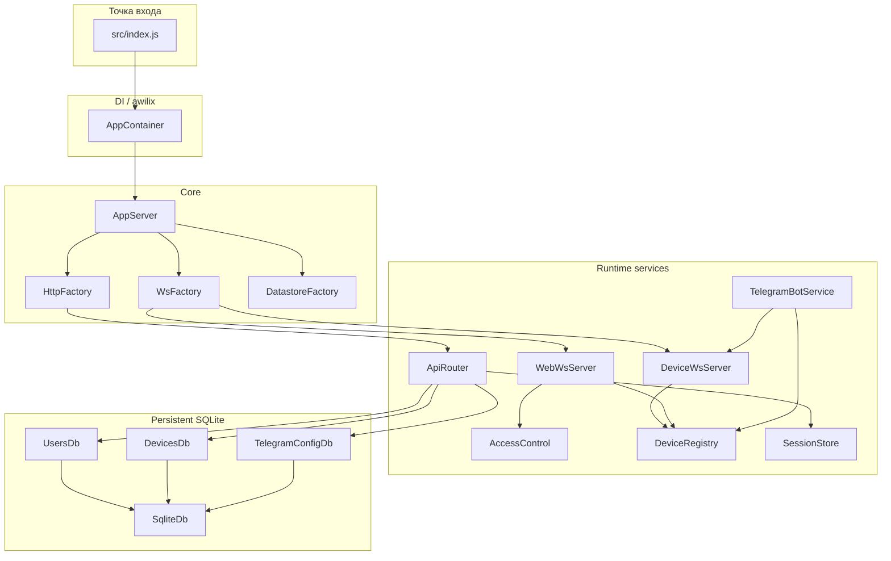

# AGENTS.md

## Назначение проекта

`plc-cloud` - облачный шлюз и веб-интерфейс для PLC/ESP32-контроллеров.

Проект отвечает за:

- аутентификацию веб-пользователей;
- поддержку websocket-сессий устройств;
- проксирование протокольных команд между браузером, Telegram и PLC;
- хранение persistent-данных в SQLite под `data/`;
- поддержку live runtime state и ACL-фильтрации в памяти.

## Текущая топология рантайма

- Web listener: `http://HOST:WEB_PORT`
- Web port по умолчанию: `80`
- Device listener: `ws://HOST:PORT/ws/device`
- Device port по умолчанию: `3001`
- Browser websocket endpoint: `ws://HOST:WEB_PORT/ws/web`

Поднимаются два отдельных HTTP-сервера:

- `webServer` обслуживает UI, REST API и `/ws/web`
- `deviceServer` принимает `/ws/device`

## Схема модулей



## Dependency Injection

Сборка приложения выполнена через `awilix`.

Entry point:

- [src/index.js](/Users/serg/plc-cloud/src/index.js)

Composition root:

- [src/app/AppContainer.js](/Users/serg/plc-cloud/src/app/AppContainer.js)

Ключевые регистрации:

- config values: `rootDir`, `dataDir`, `publicDir`, `protoPath`, `defaultObjects`, `onlineTtlMs`
- stores: `SessionStore`, `DeviceRegistry`
- databases: `SqliteDb`, `UsersDb`, `DevicesDb`, `TelegramConfigDb`
- factories: `DatastoreFactory`, `HttpFactory`, `WsFactory`
- runtime services: `ApiRouter`, `WebWsServer`, `DeviceWsServer`, `TelegramBotService`, `AppServer`

Factory-классы используют scoped registrations для runtime-значений вроде `app`, `wss`, `callbacks` и `proto`.

## Ключевые потоки

### Устройство -> облако

1. PLC подключается к `/ws/device`
2. Отправляет `hello` с `auth.api_key`
3. Cloud проверяет API key в `DevicesDb`
4. Возвращает `hello_ack` с `session_id`
5. Принимает `result`, `ack`, `event`
6. Обновляет runtime snapshot в `DeviceRegistry`
7. Шлёт обновления в browser WS и Telegram notifications

### Браузер -> облако -> устройство

1. Пользователь логинится через REST
2. Браузер подключается к `/ws/web`
3. Отправляет `send_get` или `send_cmd`
4. `WebWsServer` валидирует ACL
5. `DeviceWsServer` пересылает команду PLC
6. Ответ PLC обновляет snapshot и улетает обратно в браузер

### Telegram -> облако -> устройство

1. `TelegramBotService` работает через `grammY` long polling
2. Пользователь ищется по `chat_id` или `telegram_username`
3. Пользователь маппится на `plc_username`
4. Меню и команды фильтруются PLC ACL
5. Действия Telegram вызывают `sendCmd/sendGet`
6. Бот отправляет новый экран сообщением с inline-кнопками

## Основные backend-модули

### [src/index.js](/Users/serg/plc-cloud/src/index.js)

- создаёт `AppContainer`
- резолвит `appServer` из `awilix`
- вызывает `init()`
- запускает:
  - web listener на `WEB_PORT` или `80`
  - device listener на `PORT` или `3001`
- использует `HOST` или `0.0.0.0`

### [src/app/AppContainer.js](/Users/serg/plc-cloud/src/app/AppContainer.js)

- описывает composition root
- регистрирует БД, runtime state, фабрики и Telegram bot service
- задаёт дефолты:
  - `defaultObjects`
  - `onlineTtlMs = 30000`

### [src/app/AppServer.js](/Users/serg/plc-cloud/src/app/AppServer.js)

- главный orchestrator приложения
- инициализирует datastores, HTTP, WS и Telegram
- создаёт два HTTP-сервера из одного Express app
- запускает:
  - stale cleanup каждые 5s
  - device ping loop каждые 10s
- мостит runtime events в:
  - browser websocket broadcasts
  - Telegram notifications

### [src/app/factories/DatastoreFactory.js](/Users/serg/plc-cloud/src/app/factories/DatastoreFactory.js)

- инициализирует:
  - `UsersDb`
  - `DevicesDb`
  - `TelegramConfigDb`
- сидит sample device только при `PLC_CLOUD_SEED_SAMPLE=1`

### [src/app/factories/HttpFactory.js](/Users/serg/plc-cloud/src/app/factories/HttpFactory.js)

- собирает Express app
- включает:
  - `express.json()`
  - `cookie-parser`
  - static serving из `public/`
- принудительно задаёт UTF-8 content types
- отключает кеш UI assets
- монтирует REST routes через `ApiRouter`
- возвращает `createServer()`, чтобы тем же app обслуживать оба listener

### [src/app/factories/WsFactory.js](/Users/serg/plc-cloud/src/app/factories/WsFactory.js)

- создаёт два `WebSocketServer` с `noServer: true`
- маршрутизирует upgrade:
  - web server + `/ws/web`
  - device server + `/ws/device`
- инжектит `deviceWs` в `webWs`

### [src/http/ApiRouter.js](/Users/serg/plc-cloud/src/http/ApiRouter.js)

REST API с cookie-session auth.

Основные маршруты:

- `POST /api/login`
- `POST /api/logout`
- `GET /api/objects`
- `GET /api/devices?object=...`
- `GET /api/device/:id`
- `GET /api/admin/devices`
- `GET /api/admin/users`
- `POST /api/admin/users`
- `PUT /api/admin/users/:username`
- `DELETE /api/admin/users/:username`
- `GET /api/admin/telegram/settings`
- `PUT /api/admin/telegram/settings`
- CRUD объектов
- CRUD устройств

Особенности:

- видимость объектов и устройств ACL-фильтруется
- users admin поддерживает `username`, `password`, `plc_username`, `telegram_username`, `chat_id`
- users admin также поддерживает:
  - `telegram_notify_online`
  - `telegram_notify_offline`
  - `telegram_notify_events`
  - `notification_prefs`
  - `allowed_objects`
- Telegram settings API сейчас хранит token и legacy webhook-поля, но runtime transport уже long polling

### [src/ws/DeviceWsServer.js](/Users/serg/plc-cloud/src/ws/DeviceWsServer.js)

- валидирует envelope протокола
- обрабатывает `hello`, `ping`, `result`, `ack`, `event`
- требует `session_id` после handshake
- мерджит `payload.data` в runtime state
- хранит pending scope для `local` и `stack`
- экспортирует:
  - `sendGet(deviceId, what, unit, nodeId)`
  - `sendCmd(deviceId, controller, action, args, actor, unit, nodeId)`
  - `pingAll()`

### [src/ws/WebWsServer.js](/Users/serg/plc-cloud/src/ws/WebWsServer.js)

- аутентифицирует browser WS по cookie `session`
- поддерживает:
  - `list_devices`
  - `subscribe_device`
  - `unsubscribe_device`
  - `send_get`
  - `send_cmd`
- применяет ACL до подписки и до отправки команды
- шлёт ACL-sanitized `device_update`

### [src/auth/AccessControl.js](/Users/serg/plc-cloud/src/auth/AccessControl.js)

Текущий слой авторизации.

Отвечает за:

- маппинг session user -> PLC identity
- вычисление прав на device/object/controller
- санацию summary для REST, browser WS и Telegram
- валидацию команд через `canSendControllerCommand`

Если ACL отсутствует, код откатывается в legacy permissive-режим.

### [src/state/DeviceRegistry.js](/Users/serg/plc-cloud/src/state/DeviceRegistry.js)

- хранит in-memory device sessions
- хранит merged runtime state:
  - `system`
  - `controllers`
  - `stack`
  - `stack_units`
  - `authz`
  - `last_event`
- строит summary snapshots для UI и Telegram
- отслеживает online TTL

### [src/db/UsersDb.js](/Users/serg/plc-cloud/src/db/UsersDb.js)

SQLite-backed users DB с legacy-импортом из `data/users.json`.

Поля:

- `username`
- `password_hash`
- `plc_username`
- `telegram_username`
- `chat_id`
- `telegram_notify_online`
- `telegram_notify_offline`
- `telegram_notify_events`
- `notification_prefs_json`
- `allowed_objects_json`

Возможности:

- дефолтный `admin` с пустым паролем, если файла нет
- поиск по credentials
- поиск по Telegram identity
- rename user
- нормализация telegram username и chat ID
- хранение фильтров нотификаций
- хранение доступа к cloud-объектам

### [src/db/DevicesDb.js](/Users/serg/plc-cloud/src/db/DevicesDb.js)

SQLite-backed БД объектов и устройств с legacy-импортом из `data/devices.json`.

Поля:

- objects: `{ name, icon }`
- devices: `{ device_id, name, api_key, object_name, last_seen_ms }`

### [src/db/TelegramConfigDb.js](/Users/serg/plc-cloud/src/db/TelegramConfigDb.js)

Хранит Telegram config в SQLite с legacy-импортом из `data/telegram.json`.

Важно:

- runtime bot работает через long polling
- функционально обязателен только `token`
- `public_base_url`, `webhook_path`, `secret_token` пока сохранены как legacy-поля

### [src/bot/TelegramBotService.js](/Users/serg/plc-cloud/src/bot/TelegramBotService.js)

Telegram bot service на `grammY`.

Текущее поведение:

- long polling, не webhook
- inline-меню с отправкой нового сообщения на каждый экран
- корневой экран сразу открывает список объектов
- неизвестные Telegram users получают `Доступ запрещен`
- navigation: объект -> устройство/master-slave -> контроллеры
- отдельные меню:
  - sockets
  - lights
  - meteo
  - thermo
  - tanks
  - septic
  - watering
  - quick actions
- уведомления:
  - device online
  - device offline
  - события, кроме `reason=periodic`
- settings summary:
  - bot status
  - `Last Chat ID`
  - последний username
  - время последней активности

Menu helpers:

- [src/bot/menu/TgSocketMenu.js](/Users/serg/plc-cloud/src/bot/menu/TgSocketMenu.js)
- [src/bot/menu/TgLightMenu.js](/Users/serg/plc-cloud/src/bot/menu/TgLightMenu.js)
- [src/bot/menu/TgMeteoMenu.js](/Users/serg/plc-cloud/src/bot/menu/TgMeteoMenu.js)
- [src/bot/menu/TgThermoMenu.js](/Users/serg/plc-cloud/src/bot/menu/TgThermoMenu.js)
- [src/bot/menu/TgTankMenu.js](/Users/serg/plc-cloud/src/bot/menu/TgTankMenu.js)
- [src/bot/menu/TgSepticMenu.js](/Users/serg/plc-cloud/src/bot/menu/TgSepticMenu.js)
- [src/bot/menu/TgWateringMenu.js](/Users/serg/plc-cloud/src/bot/menu/TgWateringMenu.js)
- [src/bot/menu/TgQuickActionMenu.js](/Users/serg/plc-cloud/src/bot/menu/TgQuickActionMenu.js)

## Фронтенд

### [public/index.html](/Users/serg/plc-cloud/public/index.html)

Single-page shell с экранами:

- login
- objects
- devices
- device detail
- controllers
- network
- settings home tiles
- settings subviews:
  - objects
  - devices
  - users
  - telegram

### [public/js/main.js](/Users/serg/plc-cloud/public/js/main.js)

- orchestration UI
- REST + browser websocket integration
- settings navigation
- controller refresh
- admin actions для users/devices/objects

### [public/js/ui.js](/Users/serg/plc-cloud/public/js/ui.js)

- DOM bindings
- screen switching
- renderers для устройств, контроллеров и настроек
- user cards
- Telegram settings panel
- watering / thermo / tanks / septic editors and cards

### [public/styles.css](/Users/serg/plc-cloud/public/styles.css)

- dark theme
- responsive cards/tiles
- settings tile UI
- Telegram settings design
- controller visuals

## Данные

### `data/plc-cloud.sqlite`

Основной persistent storage проекта.

Содержит таблицы:

- `users`
- `devices`
- `device_objects`
- `telegram_config`

### `data/users.json`

```json
{
    "users": [
        {
            "username": "admin",
            "password_hash": "...",
            "plc_username": "",
            "telegram_username": "",
            "chat_id": ""
        }
    ]
}
```

### `data/devices.json`

```json
{
    "objects": [{ "name": "Квартира", "icon": "apartment" }],
    "devices": [
        {
            "device_id": 123,
            "name": "PLC",
            "api_key": "...",
            "object_name": "Квартира",
            "last_seen_ms": 0
        }
    ]
}
```

### `data/telegram.json`

```json
{
    "token": "",
    "public_base_url": "",
    "webhook_path": "/telegram/webhook",
    "secret_token": ""
}
```

## Docker

Текущие defaults:

- `WEB_PORT=80`
- `PORT=3001`

Compose публикует:

- `${WEB_HOST_PORT:-80}:80`
- `${DEVICE_HOST_PORT:-3001}:3001`

JSON-файлы выше используются только как legacy-источник для импорта.

## Ограничения и риски

- browser sessions хранятся только в памяти
- device online state хранится только в памяти
- long polling Telegram bot предполагает один активный instance на bot token
- SQLite не заменяет runtime in-memory state устройств
- storage Telegram всё ещё содержит legacy webhook-поля
- ACL зависит от того, прислал ли PLC `authz`; без него система живёт в permissive legacy-режиме
- локальный `node` на этой машине может быть сломан из-за отсутствующего `icu4c`; для проверок безопаснее Docker `node:20-alpine`

## Рекомендуемый путь расширения

Для нового контроллера:

1. расширить [proto.json](/Users/serg/plc-cloud/proto.json)
2. обновить PLC firmware contract при необходимости
3. добавить ACL mapping в [src/auth/AccessControl.js](/Users/serg/plc-cloud/src/auth/AccessControl.js)
4. добавить browser renderer в [public/js/ui.js](/Users/serg/plc-cloud/public/js/ui.js)
5. добавить browser actions в [public/js/main.js](/Users/serg/plc-cloud/public/js/main.js)
6. при необходимости добавить Telegram menu module в [src/bot/menu](/Users/serg/plc-cloud/src/bot/menu)
