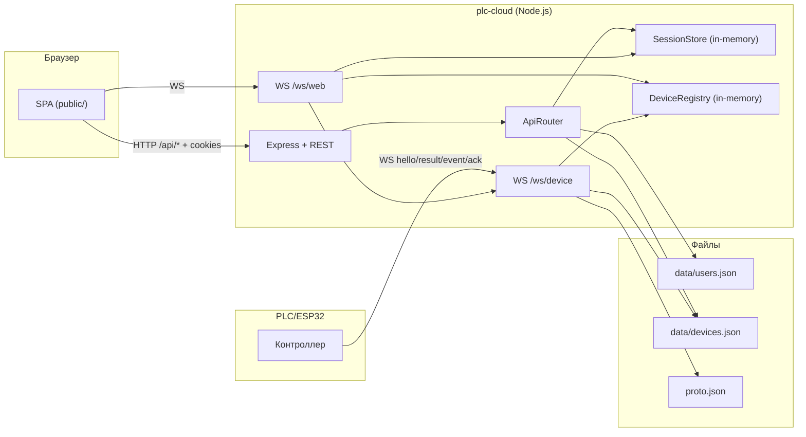
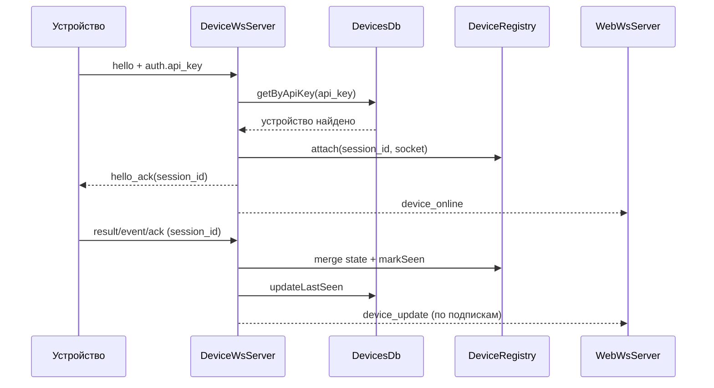
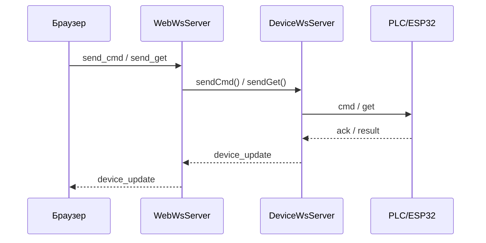

# plc-cloud

`plc-cloud` - сервер для PLC/ESP32-контроллеров с веб-интерфейсом управления.

Проект решает три основные задачи:
- аутентификация пользователей веб-интерфейса;
- поддержание онлайн-сессий устройств;
- проксирование протокольных команд между браузером и устройствами через `proto.json`.

## Что внутри

- HTTP API на `Express` (REST + раздача статики из `public/`);
- два WebSocket-канала на одном HTTP-сервере:
  - `/ws/device` - устройства (ESP32/PLC),
  - `/ws/web` - браузерные клиенты;
- JSON-хранилище в `data/`:
  - `users.json` - пользователи,
  - `devices.json` - объекты и устройства;
- оперативное онлайн-состояние устройств в памяти (`DeviceRegistry`).

## Схема архитектуры



## Поток подключения устройства



## Поток команды из веба



## Структура проекта

```text
src/
  app/
    AppServer.js
    AppContainer.js
    factories/
  db/
  http/
  state/
  utils/
  ws/
public/
  index.html
  styles.css
  js/
data/
proto.json
```

## Быстрый старт

### Требования
- Node.js 20+ (рекомендуется актуальная LTS);
- npm.

### Установка

```bash
npm install
```

### Запуск

```bash
npm start
```

Режим разработки:

```bash
npm run dev
```

По умолчанию сервер слушает:
- `host`: `192.168.1.108` (сейчас захардкожен в `src/index.js`);
- `port`: `3000` или значение `PORT`.

## Ключевые API-эндпоинты

- `POST /api/login`
- `POST /api/logout`
- `GET /api/objects`
- `GET /api/devices?object=<name>`
- `GET /api/device/:id`
- `GET /api/admin/devices`
- `POST /api/admin/objects`
- `PUT /api/admin/objects/:name`
- `PUT /api/admin/objects/:name/icon`
- `DELETE /api/admin/objects/:name`
- `POST /api/admin/devices`
- `PUT /api/admin/devices/:id`
- `POST /api/admin/devices/:id/rotate_key`
- `DELETE /api/admin/devices/:id`

## WebSocket-контракты

### `/ws/device` (устройство -> сервер)
- обязательный `hello` с `auth.api_key`;
- все сообщения после `hello` должны содержать валидный `session_id`;
- поддерживаются `result`, `event`, `ack`, `ping/pong`;
- сервер закрывает сокет при невалидной сессии или таймауте hello (10 секунд).

### `/ws/web` (браузер -> сервер)
- аутентификация по cookie `session`;
- команды: `list_devices`, `subscribe_device`, `unsubscribe_device`, `send_get`, `send_cmd`;
- события: `device_online`, `device_offline`, `device_update`, `command_sent`, `command_error`.

## Данные и состояние

- `data/users.json` - пользователи (создаётся `admin` с пустым паролем, если отсутствует);
- `data/devices.json` - объекты, иконки и устройства;
- `DeviceRegistry` хранит онлайн-сессии и слепки состояния только в памяти.

## Ограничения текущей реализации

- пользовательские сессии не персистентны (теряются при рестарте);
- онлайн-статусы устройств не персистентны;
- JSON-хранилище без транзакций/локов;
- нет ролей и тонкой авторизации;
- нет rate limit/CSRF;
- в части строк интерфейса/дефолтных объектов есть следы проблем кодировки (mojibake), требующие нормализации UTF-8.

## Где расширять проект

Чтобы добавить новый тип контроллера:
1. Описать типы/команды в `proto.json`.
2. Добавить рендер в `public/js/ui.js`.
3. Добавить действия/обработку в `public/js/main.js`.
4. Использовать существующий канал `send_get/send_cmd` через WS-серверы.
