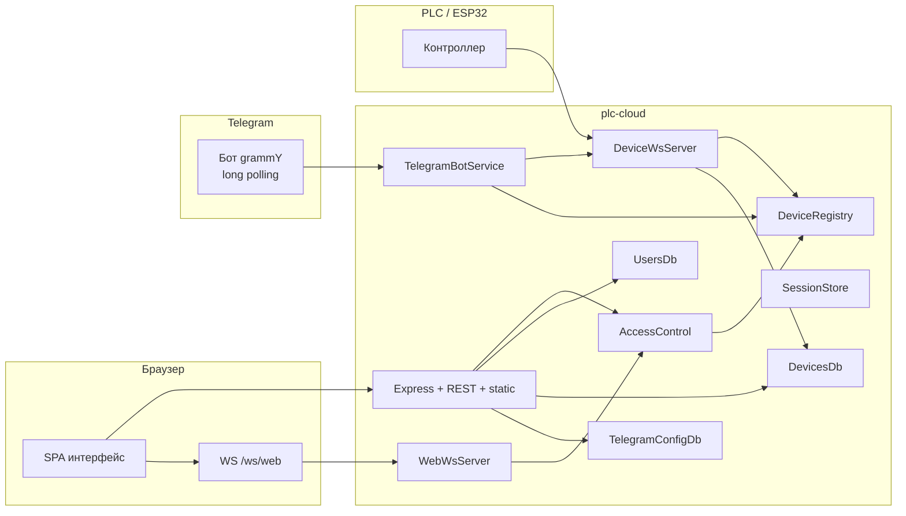
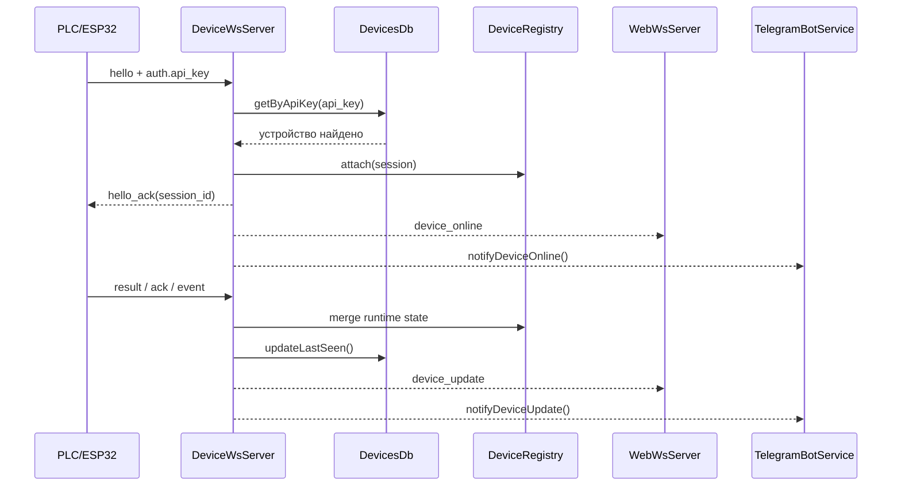
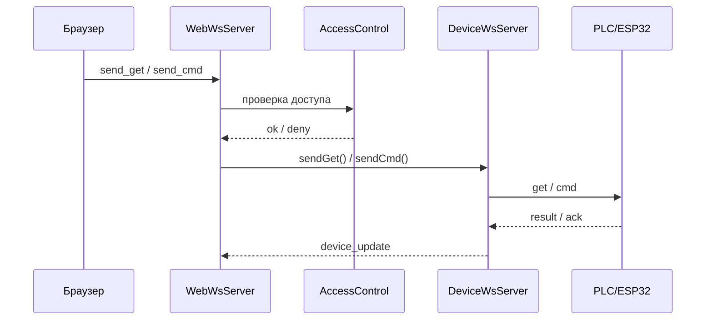
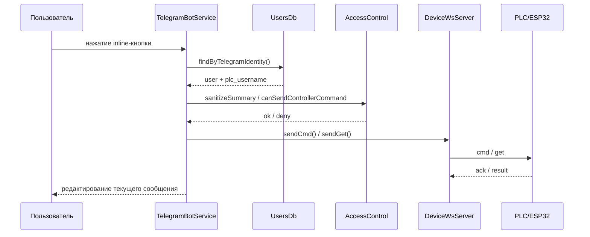

# plc-cloud

<div align="center">

🏠 ☁️ ⚙️ 🤖

**Облачный сервер для PLC/ESP32 с веб-интерфейсом и Telegram-ботом**


</div>

`plc-cloud` - облачный сервер для PLC/ESP32-контроллеров с веб-интерфейсом, браузерным WebSocket API и Telegram-ботом.

## Назначение

> 🌐 Один сервис для веба, устройств и Telegram-управления с единым runtime state.

Проект решает несколько задач:

- аутентификация пользователей веб-интерфейса;
- хранение объектов, устройств, пользователей и Telegram-настроек в JSON;
- поддержание онлайн-сессий устройств;
- проксирование протокольных `get/cmd` команд между браузером, Telegram и PLC;
- фильтрация объектов, устройств, контроллеров и команд через ACL, приходящий от PLC;
- отправка Telegram-уведомлений об онлайне, офлайне и событиях устройств.

## Текущая схема запуска

| Контур | Адрес | Назначение |
|---|---|---|
| Web UI / REST | `http://HOST:WEB_PORT` | фронтенд, REST API |
| Browser WS | `ws://HOST:WEB_PORT/ws/web` | браузерные команды и подписки |
| Device WS | `ws://HOST:PORT/ws/device` | подключение PLC/ESP32 |

- Web UI и REST API: `http://HOST:WEB_PORT`
- Browser WS: `ws://HOST:WEB_PORT/ws/web`
- Device WS: `ws://HOST:PORT/ws/device`

Порты по умолчанию:

- `WEB_PORT=80`
- `PORT=3001`

Приложение поднимает два отдельных listener:

- web listener для статики, REST и `/ws/web`
- device listener для `/ws/device`

## Стек

```text
⚙️ Express   ⚡ ws   🧩 awilix   🤖 grammY   💾 JSON storage
```

- `Express`
- `ws`
- `awilix`
- `grammY`
- JSON-хранилище в `data/`
- in-memory runtime state в `DeviceRegistry`

## Общая архитектура



## Поток данных от устройства



## Поток команды из браузера



## Поток команды из Telegram



## Dependency Injection

Сборка приложения построена через `awilix`.

Точка входа:

- [src/index.js](/Users/serg/plc-cloud/src/index.js)

Composition root:

- [src/app/AppContainer.js](/Users/serg/plc-cloud/src/app/AppContainer.js)

Основные сервисы контейнера:

- `SessionStore`
- `DeviceRegistry`
- `UsersDb`
- `DevicesDb`
- `TelegramConfigDb`
- `TelegramBotService`
- `DatastoreFactory`
- `HttpFactory`
- `WsFactory`
- `AppServer`

## Структура проекта

```text
src/
  app/
    AppContainer.js
    AppServer.js
    factories/
  auth/
    AccessControl.js
  bot/
    TelegramBotService.js
    menu/
  db/
  http/
  state/
  utils/
  ws/
public/
  index.html
  styles.css
  js/
data/
proto.json
```

## Данные

### `data/users.json`

Хранит пользователей веба и привязку к Telegram:

- `username`
- `password_hash`
- `plc_username`
- `telegram_username`
- `chat_id`

### `data/devices.json`

Хранит:

- объекты с иконками
- устройства с `device_id`, `name`, `api_key`, `object_name`, `last_seen_ms`

### `data/telegram.json`

Хранит Telegram-конфиг.

Важно:

- для long polling реально нужен только `token`
- `public_base_url`, `webhook_path`, `secret_token` сейчас остались как legacy-поля хранения

## Переменные окружения

Основные:

- `HOST`
- `WEB_PORT`
- `PORT`
- `PLC_CLOUD_SEED_SAMPLE=1`
- `TELEGRAM_BOT_TOKEN`

Legacy Telegram env-переменные, которые ещё поддерживаются как defaults для storage:

- `TELEGRAM_BOT_PUBLIC_BASE_URL`
- `TELEGRAM_BOT_WEBHOOK_PATH`
- `TELEGRAM_BOT_SECRET_TOKEN`

## Установка

```bash
npm install
```

## Запуск

```bash
npm start
```

Режим разработки:

```bash
npm run dev
```

## Docker

Сборка образа:

```bash
docker build -t plc-cloud .
```

Запуск контейнера:

```bash
docker run -d \
  --name plc-cloud \
  -p 80:80 \
  -p 3001:3001 \
  -v "$(pwd)/data:/app/data" \
  -e HOST=0.0.0.0 \
  -e WEB_PORT=80 \
  -e PORT=3001 \
  plc-cloud
```

Запуск через compose:

```bash
docker compose up -d --build
```

Текущий маппинг compose:

- `${WEB_HOST_PORT:-80}:80`
- `${DEVICE_HOST_PORT:-3001}:3001`

## REST API

Основные маршруты:

- `POST /api/login`
- `POST /api/logout`
- `GET /api/objects`
- `GET /api/devices?object=<name>`
- `GET /api/device/:id`
- `GET /api/admin/devices`
- `GET /api/admin/users`
- `POST /api/admin/users`
- `PUT /api/admin/users/:username`
- `DELETE /api/admin/users/:username`
- `GET /api/admin/telegram/settings`
- `PUT /api/admin/telegram/settings`
- CRUD объектов
- CRUD устройств

## Browser WebSocket API

Endpoint:

- `/ws/web`

Сообщения:

- `list_devices`
- `subscribe_device`
- `unsubscribe_device`
- `send_get`
- `send_cmd`

Broadcasts:

- `device_online`
- `device_offline`
- `device_update`
- `command_sent`
- `command_error`

Все snapshot'ы, которые уходят в браузер, проходят ACL-санацию.

## Device WebSocket API

Endpoint:

- `/ws/device`

Поддерживаемый цикл:

- `hello`
- `hello_ack`
- `result`
- `ack`
- `event`
- `ping/pong`

После `hello` все сообщения должны нести валидный `session_id`.

## Telegram

```text
🤖 long polling   🧭 inline-меню   🔐 ACL-фильтрация   🔔 уведомления
```

Текущий режим:

- `long polling`
- webhook не нужен

Текущая интерактивная структура:

- объекты
- устройства и stack slave-узлы
- контроллеры
- розетки
- свет
- метео
- быстрые действия

Уведомления уходят только тем пользователям, у которых:

- заполнен `chat_id`
- заполнен `plc_username`
- ACL разрешает доступ к устройству

## Фронтенд

SPA включает:

- выбор объектов
- список устройств
- статус устройства
- обзор контроллеров
- розетки
- свет
- метео
- сеть
- настройки с плитками:
  - объекты
  - устройства
  - пользователи
  - телеграм

## ACL

ACL приходит от PLC и интерпретируется в:

- [src/auth/AccessControl.js](/Users/serg/plc-cloud/src/auth/AccessControl.js)

Используется в:

- REST API
- browser websocket
- Telegram bot

Если ACL отсутствует, код работает в legacy permissive-режиме.

## Ограничения

> ℹ️ Проект ориентирован на простую файловую persistence-модель и живой runtime state в памяти.

- браузерные сессии хранятся только в памяти
- online runtime state хранятся только в памяти
- JSON-хранилище без транзакций и lock-слоя
- long polling предполагает один активный экземпляр бота на токен
- Telegram storage всё ещё содержит legacy webhook-поля
- локальный `node` на этой машине может падать из-за отсутствующего `icu4c`; для проверок безопаснее использовать Docker `node:20-alpine`

## Как расширять проект

Чтобы добавить новый контроллер:

1. расширить [proto.json](/Users/serg/plc-cloud/proto.json)
2. при необходимости согласовать контракт с прошивкой PLC
3. обновить [src/auth/AccessControl.js](/Users/serg/plc-cloud/src/auth/AccessControl.js)
4. добавить рендеринг во [public/js/ui.js](/Users/serg/plc-cloud/public/js/ui.js)
5. добавить действия во [public/js/main.js](/Users/serg/plc-cloud/public/js/main.js)
6. при необходимости добавить Telegram-меню в [src/bot/menu](/Users/serg/plc-cloud/src/bot/menu)
